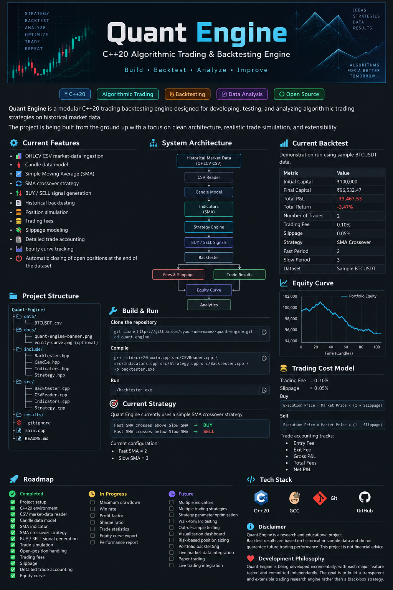

# Quant Engine

### C++20 Algorithmic Trading & Backtesting Engine



> **Build • Backtest • Analyze • Improve**

Quant Engine is a modular C++20 trading backtesting engine designed for
developing, testing, and analyzing algorithmic trading strategies on
historical market data.

The project is being built from the ground up with a focus on clean
architecture, realistic trade simulation, transparent calculations,
and future extensibility.

---

## 🚀 Current Features

- 📊 OHLCV CSV market-data ingestion
- 🕯️ Candle data model
- 📈 Simple Moving Average (SMA)
- 🔄 SMA crossover strategy
- 🟢 BUY / 🔴 SELL signal generation
- 🧪 Historical backtesting
- 💰 Position simulation
- 💸 Trading fee modeling
- 📉 Slippage modeling
- 📋 Detailed trade accounting
- 📈 Equity curve tracking
- 🔚 Automatic handling of open positions at the end of the dataset

---

## 🏗️ System Architecture

```text
                Historical Market Data
                         │
                         ▼
                  ┌─────────────┐
                  │ CSV Reader  │
                  └──────┬──────┘
                         │
                         ▼
                  ┌─────────────┐
                  │    Candle   │
                  │    Model    │
                  └──────┬──────┘
                         │
                         ▼
                  ┌─────────────┐
                  │ Indicators  │
                  │    (SMA)    │
                  └──────┬──────┘
                         │
                         ▼
                  ┌─────────────┐
                  │  Strategy   │
                  │   Engine    │
                  └──────┬──────┘
                         │
                    BUY / SELL
                         │
                         ▼
                  ┌─────────────┐
                  │ Backtester  │
                  └──────┬──────┘
                         │
              ┌──────────┴──────────┐
              ▼                     ▼
       Fees & Slippage         Trade Results
              │                     │
              └──────────┬──────────┘
                         ▼
                  ┌─────────────┐
                  │   Equity    │
                  │    Curve    │
                  └─────────────┘